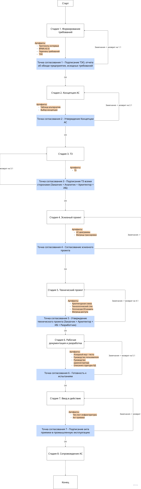

# Задание 6. Схема процесса проектирования

## 6. Схема процесса проектирования

### 6.1. Диаграмма процесса (текстовое описание блоков и переходов)

---

### 6.2. Точки согласования

| № | Точка согласования | Участники | Условие прохождения | Действие при отказе |
|---|---|---|---|---|
| КТ-1 | Подписание ТЭО | Заказчик (A), Аналитик (R) | ТЭО подписано заказчиком | Возврат на этап 1.2 — доработка требований |
| КТ-2 | Утверждение Концепции АС | Заказчик (A), ИБ (C), Аналитик (C) | Концепция подписана | Возврат на этап 2.2 — пересмотр концепции |
| КТ-3 | Подписание ТЗ | Заказчик (A), Аналитик (R), Архитектор (C), ИБ (C) | ТЗ подписано всеми | Возврат на этап 3.1 — доработка ТЗ |
| КТ-4 | Согласование эскизного проекта | Заказчик (A), Аналитик (R), Архитектор (R) | Эскизный проект согласован | Возврат на этап 4.1 — доработка UC |
| КТ-5 | Утверждение технического проекта | Заказчик (A), Архитектор (R), ИБ (C), Разработчик (C) | Технический проект утверждён | Возврат на стадию 5 — доработка проектных решений |
| КТ-6 | Готовность к испытаниям | Тестировщик (R/A), Заказчик (C) | Критические дефекты отсутствуют; ПМИ согласована | Возврат на этап 6.1 — устранение дефектов |
| КТ-7 | Приёмка в промышленную эксплуатацию | Заказчик (A), Тестировщик (R) | Акт приёмки подписан | Продолжение опытной эксплуатации |

---

### 6.3. Возвраты при дефектах

| Дефект | Откуда | Куда | Условие возврата |
|---|---|---|---|
| Неполные или противоречивые требования | КТ-1 / КТ-3 | Стадия 1, этап 1.2 | Заказчик не подписал ТЭО; замечания по требованиям |
| Несоответствие концепции границам системы | КТ-2 | Стадия 2, этап 2.2 | ИБ или заказчик отклонил концепцию |
| Неполное покрытие требований ТЗ в UC | КТ-4 | Стадия 4, этап 4.1 | Матрица трассировки UC→Требования имеет пустые ячейки |
| Архитектурные решения не соответствуют ТЗ | КТ-5 | Стадия 5, этап 5.1 | Технический проект отклонён заказчиком или ИБ |
| Критические дефекты в ПО | КТ-6 | Стадия 6, этап 6.1 | Автоматизированные тесты или ревью выявили блокирующие дефекты |
| Провальные приёмочные испытания | КТ-7 | Стадия 6, этап 6.1 | Тест-кейс ПМИ завершился с результатом «не пройден» |

---

### 6.4. Владельцы результатов по стадиям

| Стадия | Владелец результата | Основание |
|---|---|---|
| 1. Формирование требований | Аналитик | Разрабатывает и несёт ответственность за полноту требований |
| 2. Концепция АС | Архитектор | Принимает архитектурные решения |
| 3. Техническое задание | Аналитик | Координирует согласование; заказчик — утверждающая сторона |
| 4. Эскизный проект | Аналитик (UC) + Архитектор (ER) | Совместное владение двух ключевых артефактов |
| 5. Технический проект | Архитектор | Полная ответственность за проектные решения |
| 6. Разработка | Разработчик (код) + Аналитик (документация) | Разделение ответственности |
| 7. Ввод в действие | Администратор ИС (развёртывание) + Тестировщик (испытания) | Разделение по функциям |
| 8. Сопровождение | Администратор ИС | Промышленная эксплуатация |

---
