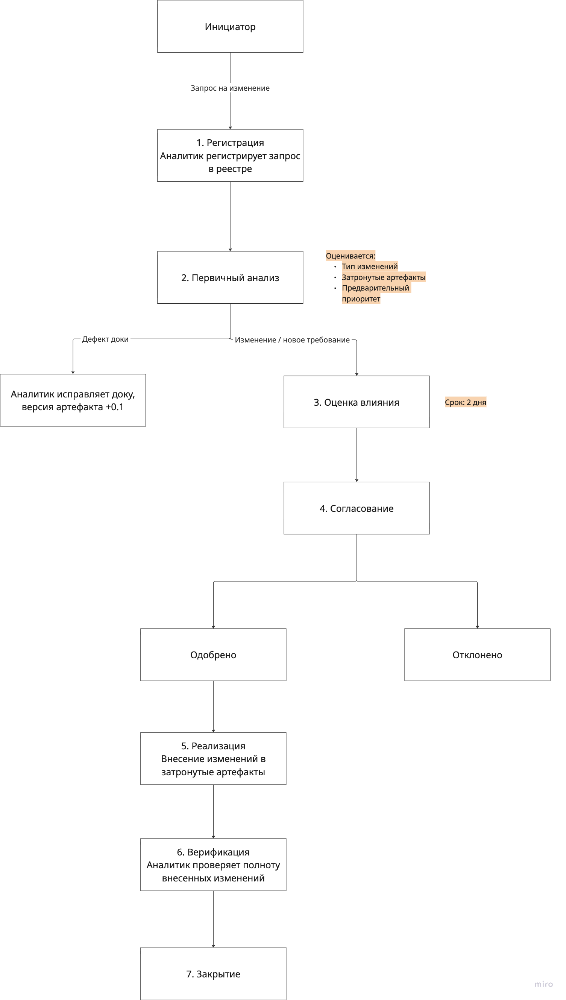

# Задание 9. Управление изменениями и трассируемость

## 9. Управление изменениями и трассируемость

### 9.1. Процесс управления изменениями требований

---

#### 9.1.1. Шаги процесса

---

#### 9.1.2. Приоритеты изменений

| Приоритет | Описание | Срок рассмотрения | Пример |
|---|---|---|---|
| **Высокий** | Изменение блокирует текущую работу или затрагивает безопасность | 1 рабочий день | Выявленная уязвимость в ролевой модели |
| **Средний** | Изменение значимо, но не блокирует работу | 3 рабочих дня | Добавление нового поля в сущность |
| **Низкий** | Косметическое или несущественное изменение | 5 рабочих дней | Переименование термина в документации |

---

#### 9.1.3. Правила версионирования при изменениях

- Любое изменение, прошедшее согласование, увеличивает версию артефакта на 0.1
- При изменении ≥ 30% содержания документа версия увеличивается на 1.0
- После каждого изменения артефакта обновляется лист согласования с датой и подписями
- Предыдущая версия хранится в архиве и не удаляется

---

### 9.2. Матрица трассируемости

---

#### 9.2.1. Структура матрицы трассируемости

| Требование ТЗ | Описание | UC (Эскизный проект) | Проектное решение (Тех.проект) | Артефакт (Разработка) | Тест-кейс (ПМИ) | Статус |
|---|---|---|---|---|---|---|
| REQ-F-001 | Создание заявки диспетчером | UC-01 | Компонент WorkorderService; таблица `work_orders` | A-17 (модуль создания заявок) | TC-001 | ✅ Реализовано |
| REQ-F-002 | Назначение исполнителя на заявку | UC-02 | WorkorderService.assignEngineer(); таблица `assignments` | A-17 (модуль назначения) | TC-002 | ✅ Реализовано |
| REQ-F-003 | Изменение статуса заявки | UC-03, UC-04 | WorkorderService.updateStatus(); таблица `work_order_statuses` | A-17 (модуль статусов) | TC-003, TC-004 | ✅ Реализовано |
| REQ-F-004 | Формирование отчёта о выполнении | UC-05 | ReportService; таблица `work_reports` | A-17 (модуль отчётов) | TC-005 | ✅ Реализовано |
| REQ-F-005 | Просмотр истории изменений заявки | UC-06 | AuditService; таблица `audit_log` | A-17 (модуль аудита) | TC-006 | ✅ Реализовано |
| REQ-F-006 | Эскалация просроченных заявок | UC-07 | EscalationService; CRON-задача | A-17 (модуль эскалации) | TC-007 | ✅ Реализовано |
| REQ-F-007 | Формирование аналитических отчётов | UC-08 | AnalyticsService; представления БД | A-17 (модуль аналитики) | TC-008 | ✅ Реализовано |
| REQ-NF-001 | Разграничение доступа по ролям | — | Матрица доступа (A-15); AuthService | A-17 (auth-модуль) | TC-009 | ✅ Реализовано |
| REQ-NF-002 | Аудит действий пользователей | — | AuditService; таблица `audit_log` | A-17 (модуль аудита) | TC-010 | ✅ Реализовано |
| REQ-NF-003 | Резервное копирование данных | — | Инфраструктурное решение (A-19) | A-22 (чек-лист инфраструктуры) | TC-011 | ✅ Реализовано |

*Примечание: таблица является шаблоном; конкретные идентификаторы UC, компонентов и тест-кейсов уточняются на соответствующих стадиях проекта.*

---

### 9.3. Правила разрешения конфликтов

